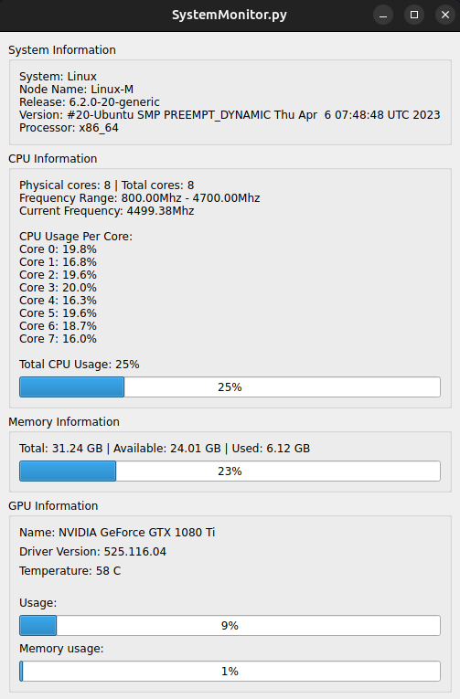

# SystemMonitor (GUI)

An open-source Python program with a GUI that retrieves and displays information about your system's processor, memory, and running processes.

<p align="center">
  
</p>

## Requirements

- Python 3
- PIP

## Dependencies

The following Python packages are required:

- psutil
- PyQt5
- pynvml
- pyinstaller

### Building the Application from Source

```bash
pyinstaller --onefile --windowed ./SystemMonitor.py
```

After that your executable will be available at the `dist` folder, just double-click it, and 🎉🎉🎉 !
